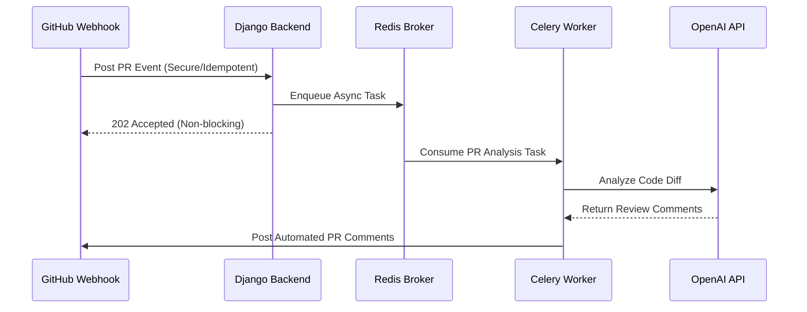

# AI Pull Request Reviewer (GitHub App)

An AI-powered GitHub App that automatically reviews Pull Requests when they are opened or updated.

The app listens to GitHub webhook events, fetches the PR diff using GitHub App authentication, processes it asynchronously with Celery, and posts review comments back to GitHub.

---

## Features

- GitHub App–based authentication (JWT + installation tokens)
- Secure webhook handling with signature verification
- Automatic PR review on `opened` and `synchronize` events
- Idempotent webhook processing using `X-GitHub-Delivery`
- Background processing with Celery (non-blocking webhooks)
- Task activation/deactivation per repository

---

## Tech Stack

- **Backend:** Django
- **Async Tasks:** Celery + Redis
- **Auth:** GitHub App (no OAuth token dependency)
- **Webhooks:** GitHub Pull Request events

---

## How It Works

1. GitHub sends a `pull_request` webhook
2. Signature is verified
3. Task status and duplication are checked
4. PR diff is fetched using GitHub App installation token
5. Review is processed asynchronously
6. Comments are posted back to GitHub

---

## Notes

- Webhooks always return `2xx` for valid but ignored events to prevent retries
- Deactivated tasks are safely ignored
- No Celery results backend is required (fire-and-forget)

---

## License
Distributed under the MIT License.